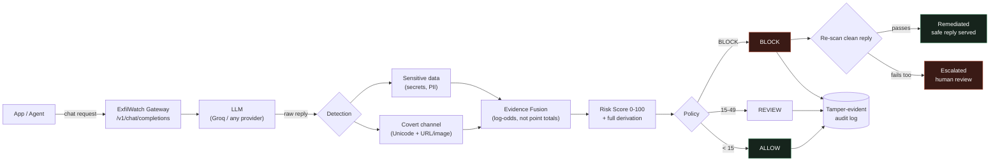
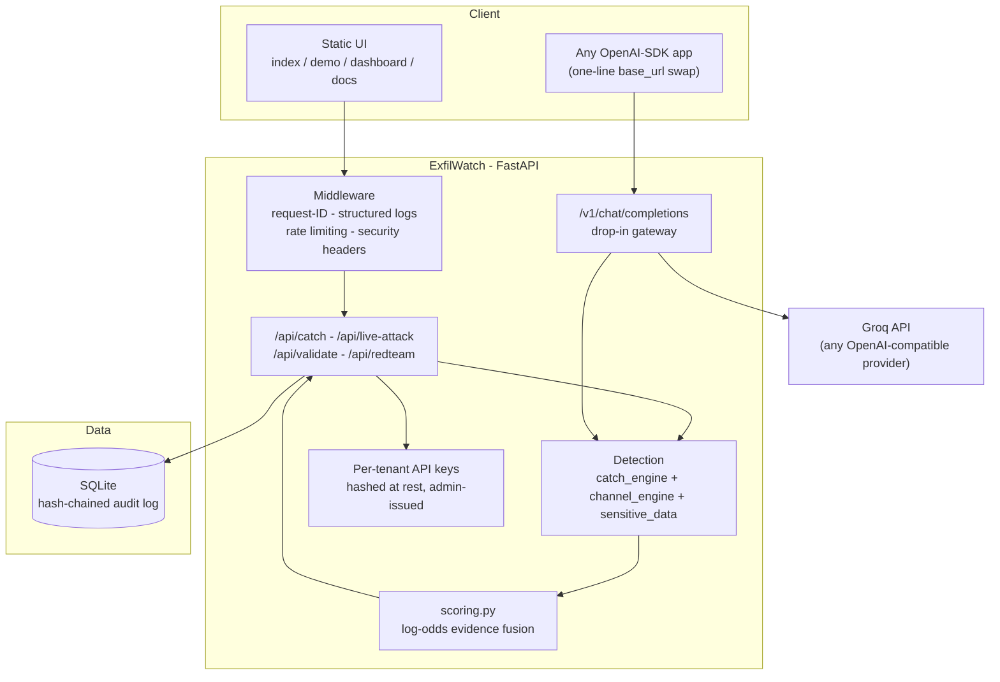

<div align="center">

# ExfilWatch
### The security gateway for what your AI says on the way out.

**Every DLP tool scans what goes *into* a model. Nothing standard scans what comes *out* — and that's exactly where a compromised or careless model leaks.**

[](.github/workflows/ci.yml)
[](#-real-evaluation-not-a-claim)
[](#-real-evaluation-not-a-claim)
[](#-we-attacked-our-own-detector-live)
[](#tech-stack--why-each-piece)

[Quick start](#quick-start-verified) · [Demo flow](#-2-minute-demo-flow) · [Architecture](#architecture) · [Self red-team](#-we-attacked-our-own-detector-live) · [API](#api--one-line-integration)

</div>

---

## The problem

An LLM's reply looks like plain, harmless text. It can also carry a secret — hidden in invisible Unicode characters, or in a markdown image URL your chat client auto-fetches with zero clicks. The visible words never change. Every conventional DLP tool reads the visible words. **Nothing gets flagged, because nothing looks wrong.**

This isn't hypothetical. **GlassWorm**, a supply-chain worm active since October 2025, uses exactly this technique — invisible Unicode Variation Selectors — and had spread to 400+ compromised packages across npm, OpenVSX, and the VS Code Marketplace by March 2026.

## Why existing approaches miss it

| Approach | What it checks | What it misses |
|---|---|---|
| Prompt-injection filters | The *input* to the model | Anything hidden in the *output* |
| Standard DLP / regex scanners | Visible plaintext patterns | Invisible characters, encoded payloads |
| Content moderation APIs | Toxicity, policy violations | Covert channels aren't toxic — they're invisible |
| "AI safety" wrappers | Refusals, jailbreaks | A model that complies normally can still leak via its output encoding |

ExfilWatch is the layer none of these are built to be: **a gate on the model's output**, sitting between the LLM and whoever reads its reply.

---

## What ExfilWatch is

An inline enforcement gateway, not a dashboard that tells you about a leak after it already happened. Point an existing OpenAI-SDK app at it by changing **one line** — `base_url` → `/v1` — and every completion gets scanned before the caller ever sees it. Non-clean output doesn't get logged-and-forwarded; it gets **withheld**.



**BLOCK isn't the end of the pipeline — it's the start of remediation.** When the tampered reply is blocked, the underlying clean reply is *independently re-scanned* (never assumed safe — a model can leak a secret in plain text too) and served automatically if it passes. If it doesn't, the request escalates to a human instead of guessing. No unverified text ever ships either way.

---

## Detection: two real channels, not one

**1. Covert Unicode channel** — decodes two named schemes on contact (our own zero-width scheme, and the **Variation Selector** encoding GlassWorm actually uses), plus statistical anomaly scoring for unpublished schemes via invisible-character density and formatting-control overload.

**2. Zero-click URL/image exfiltration** — the other well-documented real channel: a markdown image or link whose URL parameters decode to base64/hex/plaintext data. Chat UIs auto-fetch images, so this leaks with *no click at all*. `channel_engine.py` decodes candidate URL parameters and flags ones that resolve to coherent, printable text — random tracking tokens don't decode; exfiltrated secrets do.

**3. Sensitive-data scan** — named-pattern matching (API keys, AWS credentials, emails) plus entropy-based generalization for secrets that don't match any known pattern shape.

### Evidence fusion, not hand-tuned point totals

Most detectors combine signals with arithmetic folklore: *"+20 if X, +35 if Y."* There's no defensible answer to "why 20 and not 15." ExfilWatch fuses evidence with **naive-Bayes log-odds combination** — the same principle behind classical Bayesian spam filters — where each signal contributes a likelihood ratio, not a guessed point value:

```
log_odds = log_odds(prior) + sum(log(likelihood_ratio_i))
risk_score = sigmoid(log_odds) x 100
```

Every contribution is shown in the UI as a waterfall — a judge (or a security reviewer) can see *exactly* which signal moved the score, by how much, and why. This is explicitly **not** framed as machine learning — it's principled evidence combination, checked against a labeled corpus by `validate.py`, not a trained model with a hidden decision boundary.

---

## We attacked our own detector, live

Almost every "AI security" hackathon submission ships a detector and claims an accuracy number. `GET /api/redteam` does what a real security team does before shipping anything: **attacks its own system and publishes what happens.**

Four genuine adversarial attempts against real mechanisms in this codebase — run fresh on every call, not cached:

| Attack | Targets | Result |
|---|---|---|
| **Dilution** — same payload in a ~400-word cover | Density-ratio scoring | Caught |
| **Legitimate-exemption side channel** — bits hidden in emoji presentation selectors | The emoji allowlist that prevents false positives | Caught |
| **Scheme stacking** — both schemes combined in one message | Whether stacking helps evade either detector | Caught |
| **Fragmentation** — secret split across two separate replies | Stateless, single-message scope | **Evades** — disclosed, with a specific fix |

**1 of 4 evades, on purpose left unfixed.** A same-day patch built to beat its own test proves nothing. The honest finding: this is a stateless, single-message gate — closing cross-message fragmentation needs session-level state (an invisible-character budget tracked per conversation), which is named here as the top roadmap item, not hidden. That's the difference between a security claim and a security *measurement*.

---

## Real evaluation, not a claim

`GET /api/validate` runs the full pipeline against a labeled corpus **fresh on every call** — a judge can trigger this themselves and get the real number, not a screenshot of one:

| Metric | Value | Corpus |
|---|---|---|
| Precision | **96.8%** | 30 malicious samples (both covert schemes + sensitive-data leaks) |
| Recall | **100%** | 23 benign samples (ordinary AI-reply-style sentences) |
| False positive rate | **4.3%** | 53 total labeled samples |
| Accuracy | **98.1%** | — |

These numbers came from running `validate.py` against this exact codebase, not a spreadsheet. Run it yourself: `curl -H "X-API-Key: demo-key-12345" localhost:8000/api/validate`.

---

## Tamper-evident audit log

Every scan is written to SQLite as a **SHA-256 hash chain** — each row hashes its own fields plus the previous row's hash, the same block-linking principle behind a blockchain, without the mining. Edit or delete any past entry and every hash after it breaks. `GET /api/audit/verify` recomputes the whole chain and reports the first broken row, if any — this is what a compliance team actually needs from an audit trail: **proof it wasn't edited**, not just a log file someone promises wasn't touched.

---

## Architecture



---

## The interface

*(Run the server locally and open these routes to see them live — one dark, restrained console design across every page, no generic SaaS gradients.)*

| Route | What it shows |
|---|---|
| `/` | Problem, mechanism, and the illustrated Request→Detection→Evidence→Risk→Decision pipeline |
| `/demo` | **Live Console** — a real Groq model reply, a real tampered version, character-level "X-ray" of the hidden payload, the evidence waterfall, and the mitigation outcome |
| `/dashboard` | Investigation timeline (click a scan to expand it), live risk chart, action breakdown, one-click **Run detector validation** and **Run self red team** |
| `/docs-page` | Full endpoint reference and drop-in integration snippet |

---

## API — one-line integration

**Drop-in gateway** (OpenAI-compatible — the whole point is you don't rewrite your app):

```python
from openai import OpenAI
client = OpenAI(base_url="http://localhost:8000/v1", api_key="demo-key-12345")
resp = client.chat.completions.create(model="any", messages=[{"role": "user", "content": "..."}])
# resp includes an `exfilwatch` block: {withheld, max_risk_score, findings}
```

**Direct scan** (any backend, any language):

```bash
curl -X POST http://localhost:8000/api/catch \
  -H "X-API-Key: demo-key-12345" -H "Content-Type: application/json" \
  -d '{"text": "the LLM reply to check"}'
```

```json
{
  "verdict": "HIDDEN DATA DECODED", "risk_score": 100, "action": "BLOCK",
  "decoded_message": "internal_api_key=sk-prod-7f3a9c2b", "technique": "variation_selector",
  "evidence": [{"signal": "Variation Selector payload match", "likelihood_ratio": 500.0, "log_odds_delta": 6.21}]
}
```

Other endpoints: `/api/live-attack` (real model + tamper + remediate), `/api/validate`, `/api/redteam`, `/api/audit/verify`, `/api/history`, `/api/stats`, `/api/admin/keys` (per-tenant issuance), `/healthz`, `/readyz`, `/metrics` (Prometheus format).

---

## Tech stack — why each piece

| Layer | Choice | Why, specifically for this product |
|---|---|---|
| API | **FastAPI** | Async, typed request/response models via Pydantic — the evidence/remediation schemas *are* the API contract, not a loosely-typed dict |
| Detection | **Pure Python, deterministic** | No opaque ML decision boundary — every verdict traces to a named signal and a likelihood ratio, which is what "explainable" has to mean for a security tool |
| Scoring | **Log-odds fusion (naive Bayes)** | Principled combination instead of hand-picked point totals — see `scoring.py` |
| Storage | **SQLite + SHA-256 hash chain** | Zero-ops for a demo; the hash chain gives tamper-evidence without a separate ledger service |
| LLM | **Groq (OpenAI-compatible)** | Free tier, fast inference — the live-attack demo calls a genuine model, not a canned string |
| Observability | **Structured JSON logs + Prometheus `/metrics`** | `request_id` propagation and histogram/counter metrics — the operational baseline any real deployment is graded on |
| Security | **Hashed per-tenant API keys, constant-time admin auth, rate limiting, security headers** | HMAC comparison prevents timing attacks on the admin key; token-bucket rate limiting is hand-rolled (see `ratelimit.py`) so the algorithm is visible, not hidden behind a library |
| Deployment | **Dockerfile + docker-compose + GitHub Actions CI** | `pytest` + `validate.py` + `docker build` run on every push — this isn't a stack chosen for buzzwords, it's the minimum a judge can verify by running `docker build .` themselves |
| Frontend | **Vanilla HTML/CSS/JS** | No build step, no framework overhead — every visual (signal view, evidence waterfall, risk gauge, investigation timeline) is hand-built SVG/DOM |

---

## Deployment & use cases

- **LLM gateway** for any team running an internal AI assistant with tool/data access — drop-in via the `/v1` endpoint.
- **CI/CD guardrail** for AI-generated content pipelines — call `/api/catch` before publishing any AI-authored output.
- **Compliance evidence** — the hash-chained audit log plus live `/api/validate` numbers are exactly what a security review asks for: not "we have controls," but "here's proof, verify it yourself."

Run with `docker-compose up` for a persistent volume, or bare `uvicorn` for local development — both use the identical codebase, verified by the same CI pipeline.

---

## Limitations & roadmap — stated, not hidden

This is a **stateless, single-message gate**, by design and by disclosure:

- **Cross-message fragmentation** (the one red-team finding that evades) needs session-level state — an invisible-character budget tracked per conversation. Named here as the top roadmap item, not a hidden gap.
- **Likelihood ratios are engineering estimates**, checked against a 53-sample labeled corpus, not learned from a large real-world dataset. Scaling the corpus is the fastest way to make the fusion scores more trustworthy.
- **Rate limiting and audit storage are in-process/SQLite** — correct for one instance; a multi-instance deployment needs shared state (Redis for rate limits, Postgres for the audit log) to enforce the same limits and chain across replicas.
- **No learned/ML detector yet** — today's detection is deterministic and explainable on purpose; a statistical anomaly model could catch schemes with no named signature at all, at the cost of losing some explainability.

---

## 2-minute demo flow

1. **`/demo`** — run a live attack with the default GlassWorm scheme. Two replies look identical. Click **X-ray** on the tampered one — hidden characters light up.
2. Watch the payload resolve in the decoded box, and the evidence waterfall show exactly which signals fired.
3. Scroll to **Mitigation** — the tampered reply is blocked, the clean reply is independently re-verified, and served. Not an alert — a decision.
4. Switch scheme to the **URL/image channel** and run again — a different attack, no invisible characters at all, still caught.
5. **`/dashboard`** — audit chain shows *intact*, run **live validation** (real precision/recall), then **Run self red team** — watch it attack itself, live, 3 caught / 1 disclosed gap with its fix.
6. Close: *"One line to adopt — change your `base_url` to `/v1`."*

---

## Quick start (verified)

```bash
git clone <this-repo> && cd exfilwatch_v6
pip install -r requirements.txt
cp .env.example .env               # optional: add GROQ_API_KEY for the live-model demo
uvicorn main:app --reload
```

Open **http://127.0.0.1:8000**. Or with Docker: `docker-compose up --build`.

Run the test suite and the live corpus check exactly as CI does:
```bash
pip install -r requirements-dev.txt && pytest -q && python validate.py
```

---

<div align="center">

### The gap isn't in the model. It's in what happens to its output after it's generated.

**ExfilWatch is that missing layer — detecting, explaining, and now closing the loop, not just logging the leak.**

*Built for Hack Devengers 2.0*

</div>
